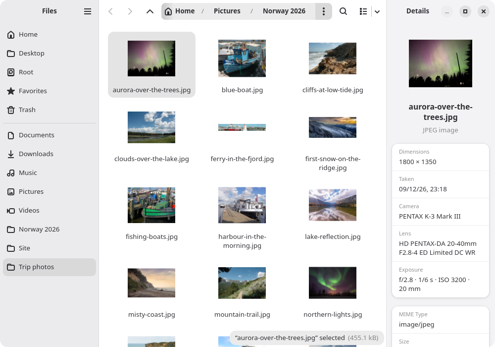

# Spiral

Spiral is a file manager for Wayland, written in Rust with GTK 4 and libadwaita. It is
also a file chooser portal backend, so other applications open and save files in the same
dialog.

It does not depend on any desktop session. You need a Wayland compositor, a session bus,
GTK 4.22 and libadwaita 1.9.

Grid and list views, an optional column view, tabs, a places sidebar with devices,
bookmarks and network shares, background file operations with progress, conflict handling
and undo, archives through whatever tools are installed, thumbnails, a Space preview for
images, video, sound, text and PDFs, a details panel, drag and drop, "Open in Terminal",
servers reached through gvfs, the `org.freedesktop.FileManager1` service for "Show in
folder" and the portal backend. Pictures are decoded by glycin in its own sandbox where it
is installed. Thumbnailers, the reader of file details for the details panel, archive
tools, the PDF previewer, the preview's decoders of video and sound, and of pictures where
glycin is missing, run under bubblewrap, which is required: they read files from anywhere,
and Spiral has no unsandboxed path for them.

## Packages

Fedora 44, 45 and Rawhide, from the Copr project
[sachesi/software](https://copr.fedorainfracloud.org/coprs/sachesi/software/):

    sudo dnf copr enable sachesi/software
    sudo dnf install spiral

openSUSE Tumbleweed and Slowroll, from the OBS project
[home:sachesi:software](https://build.opensuse.org/project/show/home:sachesi:software); for
Slowroll the address has `openSUSE_Slowroll` in it, and on aarch64 `openSUSE_Factory_ARM`:

    sudo zypper addrepo https://download.opensuse.org/repositories/home:sachesi:software/openSUSE_Tumbleweed/home:sachesi:software.repo
    sudo zypper install spiral

Debian testing and Ubuntu 26.04, from the same OBS project; for Ubuntu the addresses
have `xUbuntu_26.04` in place of `Debian_Testing`:

    sudo install -d /etc/apt/keyrings
    curl -fsSL https://download.opensuse.org/repositories/home:sachesi:software/Debian_Testing/Release.key | sudo gpg --dearmor -o /etc/apt/keyrings/sachesi-software.gpg
    echo 'deb [signed-by=/etc/apt/keyrings/sachesi-software.gpg] https://download.opensuse.org/repositories/home:sachesi:software/Debian_Testing/ /' | sudo tee /etc/apt/sources.list.d/sachesi-software.list
    sudo apt update
    sudo apt install spiral

Debian 13 and Ubuntu 24.04 ship a GTK and libadwaita older than Spiral needs.

Arch Linux: the AUR package `spiral-file-manager`, built from
[packaging/aur/PKGBUILD](packaging/aur/PKGBUILD), which each release tag updates.

The same packages are attached to each [release](https://github.com/sachesi/spiral/releases).

## Building and installing

    just build
    sudo just install        # or: just prefix=$HOME/.local install
    just set-default         # folders open in Spiral
    just setup-portal        # file dialogs of other apps use Spiral

Build needs Rust 1.92, `blueprint-compiler`, `just` and the development packages for GTK,
libadwaita, GtkSourceView 5, libseccomp and GStreamer; running needs the GStreamer base plugins
and the GTK 4 sink (`gstreamer1-plugin-gtk4` on Fedora) for the media preview. Details, other
prefixes and removal are in [docs/installing.md](docs/installing.md).

After an update, quit the old processes: `pkill -x spiral; pkill -f xdg-desktop-portal-spiral`.

## Documentation

- [Installing](docs/installing.md)
- [Using Spiral](docs/usage.md), including [keyboard shortcuts](docs/keyboard-shortcuts.md) and [settings](docs/settings.md)
- [File operations](docs/file-operations.md)
- [Archives](docs/archives.md), [thumbnails](docs/thumbnails.md), [terminal](docs/terminal.md)
- [Portal and D-Bus integration](docs/integration.md)
- [Contributing](CONTRIBUTING.md), including where things are in the code, and [reporting a vulnerability](SECURITY.md)

Search walks subfolders and can look inside text files, without an index. Tabs are not
restored between runs. The interface is available in English, Russian and Ukrainian.

GPL-3.0-or-later.
